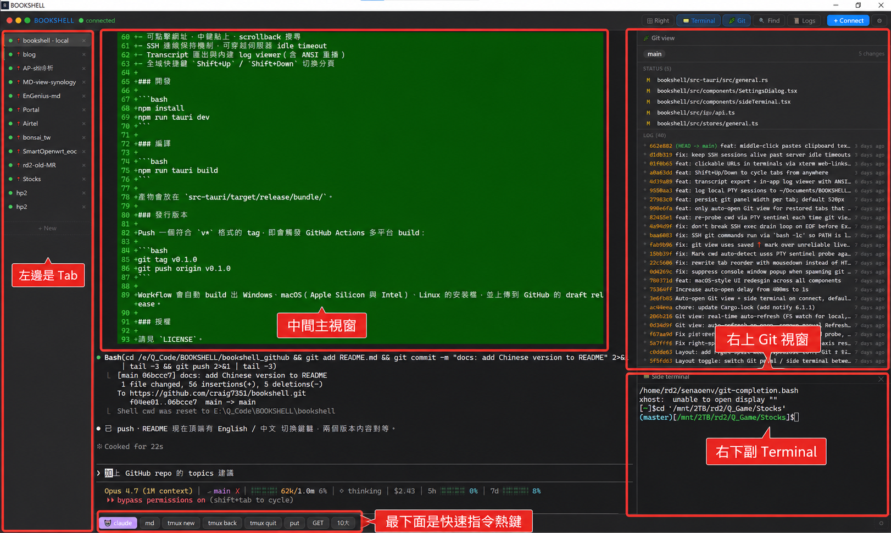
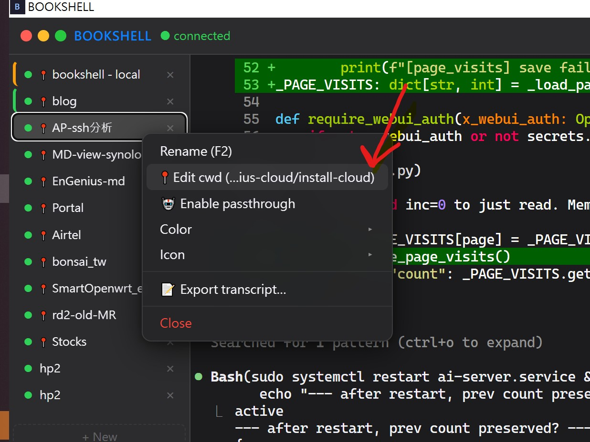
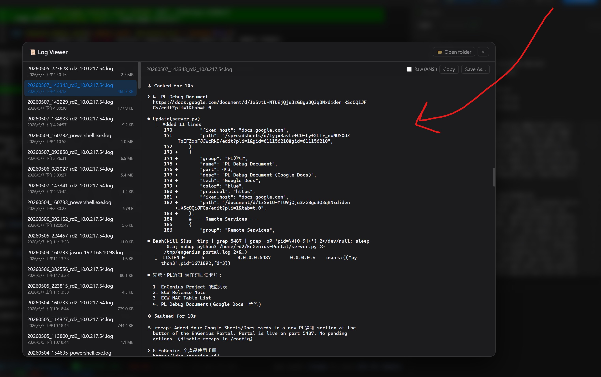
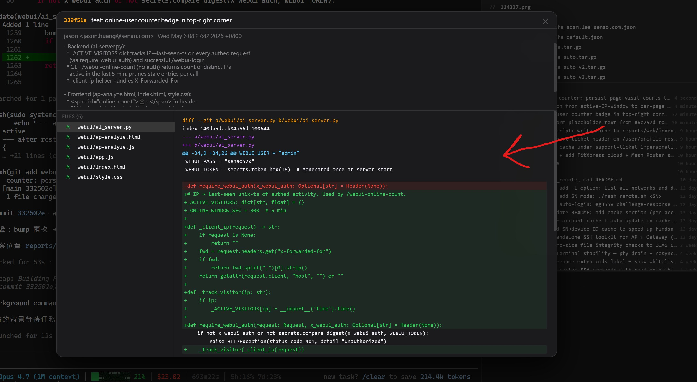

# BOOKSHELL

專為 AI agent 工作流設計的 SSH 終端機 —— 基於 Tauri 2 + SolidJS 的桌面應用程式，支援多分頁 xterm 連線。

[English](README_EN.md) | **中文**



## 功能特色

- 多分頁 SSH 與本機 shell 連線（xterm.js + WebGL 渲染）
- 左側 tab 可記住工作目錄，重開軟體後自動 `cd` 回該位置
- 左側 tab 支援拖拉排序
- 文字搜尋（find）結果以顏色 highlight
- 下方可自訂快速指令按鈕，一鍵送出常用指令
- 右側可開 Git view，即時顯示當下 git 狀態；點 modified 檔案直接看 diff
- 右下角可開副視窗終端機，與主視窗共用工作目錄，主視窗在跑 AI agent 時可同步下其他指令
- 獨立字體大小設定的 side terminal 面板
- 可點擊網址、中鍵貼上、scrollback 搜尋
- SSH 連線保持機制，可穿越伺服器 idle timeout
- Transcript 匯出與內建 log viewer（含 ANSI 重播）
- 全域快捷鍵 `Shift+Up` / `Shift+Down` 切換分頁

## 畫面截圖

**固定分頁工作目錄** — 透過 tab 右鍵 `cwd` 可固定該分頁的工作目錄；下次重開軟體會自動進入設定的資料夾。



**Logs 面板** — 右上角 Logs 自動記錄所有 tab 的內容，包含跟 AI agent 的對話。



**Git view** — 可直接檢視某個 SHA 內所修改的內容。



## 開發

```bash
npm install
npm run tauri dev
```

## 編譯

```bash
npm run tauri build
```

產物會放在 `src-tauri/target/release/bundle/`。

## 發行版本

Push 一個符合 `v*` 格式的 tag，即會觸發 GitHub Actions 多平台 build：

```bash
git tag v0.1.0
git push origin v0.1.0
```

Workflow 會自動 build 出 Windows、macOS（Apple Silicon 與 Intel）、Linux 的安裝檔，並上傳到 GitHub 的 draft release。

## 授權

請見 `LICENSE`。
