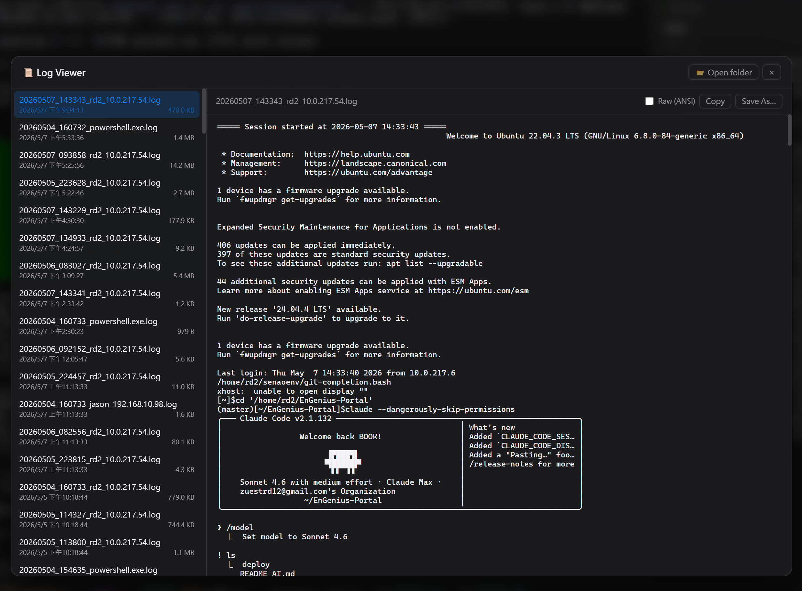
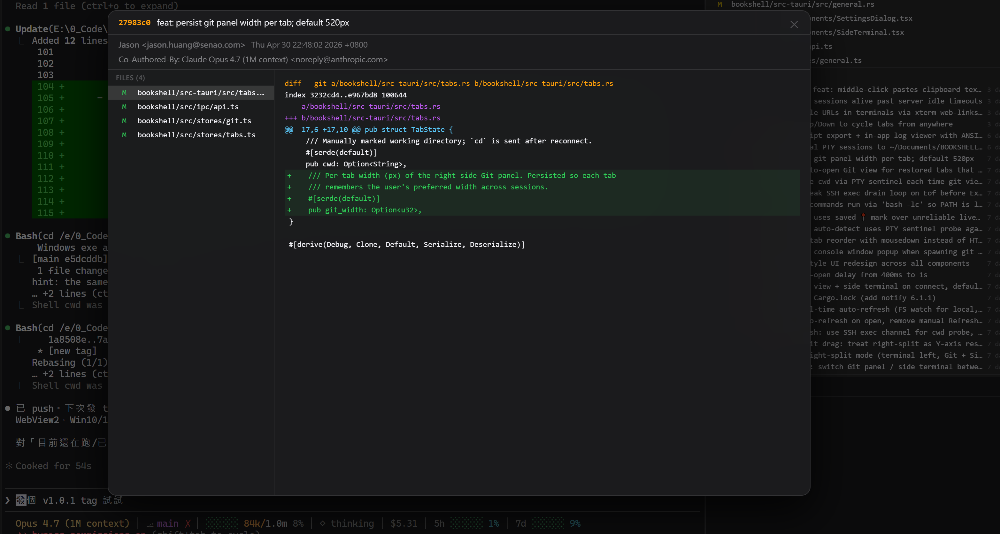

# BOOKSHELL

SSH terminal for AI agents — a Tauri 2 + SolidJS desktop app with multi-tab xterm sessions.

**English** | [中文](README.md)


## Features

- Multi-tab SSH and local shell sessions (xterm.js + WebGL renderer)
- Left tabs remember their working directory — auto-`cd` back on next launch
- Drag-and-drop tab reordering in the left sidebar
- Find-in-buffer with colored match highlighting
- Customizable quick-command buttons along the bottom for one-click frequent commands
- Right-side Git view with live status; click any modified file to see its diff
- Bottom-right side terminal sharing the main tab's cwd — handy for issuing commands while an AI agent is busy in the main pane
- Side terminal panel with independent font size
- Clickable URLs, middle-click paste, scrollback search
- Drag-and-drop files onto a local tab to paste their quoted path(s); SSH tabs show a "not supported" notice
- Clipboard image paste (`Ctrl+V`): local tabs paste the local file path; SSH tabs upload the image to `/tmp/bookshell-clip/` on the remote and paste the remote path
- Persistent SSH sessions with keepalive past server idle timeouts
- Transcript export and in-app log viewer with ANSI replay
- Tab cycling via `Shift+Up` / `Shift+Down` from anywhere

## Screenshots

**Pin a tab's working directory** — right-click a tab and set `cwd`. The path is remembered, so next time you launch BOOKSHELL the tab opens directly in that folder.


**Logs panel** — the top-right Logs view automatically records every tab's content, including conversations with your AI agent.



**Git view** — inspect the changes inside any commit by SHA.



## Development

```bash
npm install
npm run tauri dev
```

## Building

```bash
npm run tauri build
```

Output goes to `src-tauri/target/release/bundle/`.

## Releases

Push a tag matching `v*` to trigger a multi-platform GitHub Actions release build:

```bash
git tag v0.1.0
git push origin v0.1.0
```

The workflow builds installers for Windows, macOS (Apple Silicon and Intel), and Linux, then uploads them to a draft release on GitHub.

## License

See `LICENSE`.
